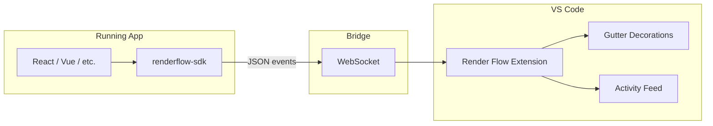

# Render Flow – Architecture

## Overview

Render Flow provides **real-time visual telemetry** between a running frontend application and VS Code. When your app renders or updates state, the corresponding source locations are highlighted in the editor and listed in an Activity Feed.

## Components

### 1. VS Code Extension (this repo, root)

- **Role:** Listens for render events and updates the editor UI.
- **WebSocket server:** Binds to `127.0.0.1` on a configurable port (default `8765`). Only local connections are accepted (local development only).
- **On each event:**
  - Resolves `filePath` (relative or absolute) to a workspace file.
  - Applies a short-lived **gutter/line decoration** (flash) in the corresponding editor.
  - Appends the event to an in-memory list and refreshes the **Activity Feed** tree view.
- **Configuration:** Port, activity feed max items, and gutter flash duration are exposed in VS Code settings under `renderflow.*`.
- **Future:** Filtering (glob, min interval, function name), throttling/batching, and heatmap aggregation will plug in here without changing the protocol.

### 2. SDK (`packages/renderflow-sdk`)

- **Role:** Injected into the application bundle. Captures “this render happened at file:line” and sends it to the extension.
- **API:** `connect(port?)`, `sendEvent({ filePath, line, column?, functionName?, kind? })`, `disconnect()`, `isConnected()`.
- **React:** `useRenderFlow(options?)` hook and `reportRender(event)` for manual instrumentation. The hook can infer location from the call stack when the bundler preserves it.
- **Transport:** Browser `WebSocket` client to `ws://127.0.0.1:<port>`. Reconnects on disconnect.

### 3. Protocol (WebSocket, JSON)

- **Direction:** App → Extension only (one-way events).
- **Message format:** See [PROTOCOL.md](PROTOCOL.md).
- **Port/host:** Extension runs the server; SDK connects. Port is configured in VS Code; SDK defaults to `8765`.

## Data Flow

1. User interacts with the app (e.g. clicks a button).
2. Framework re-renders; SDK (or manual call) sends an event `{ filePath, line, functionName?, ... }`.
3. Extension receives the message, resolves `filePath` to a workspace URI.
4. Extension updates gutter decorations for the matching editor and appends to the activity list; tree view refreshes.
5. Optional: user clicks an item in the Activity Feed → extension opens the file at the given line.

## Where Future Features Plug In

- **Noise control:** Extension-side filtering (glob, debounce per line, function name pattern) before applying decorations and before appending to the feed.
- **Throttling/batching:** Extension batches rapid events and shows a single “burst” indicator.
- **Heatmaps:** Extension aggregates events per file/line over a session and displays a separate view; persistence in workspace state if needed.
- **More frameworks:** New instrumentation in the SDK (Vue, Angular, Svelte) reusing the same `sendEvent` and protocol; extension remains framework-agnostic.

## Security

- The WebSocket server binds to `127.0.0.1` only. No remote access.
- Intended for local development only; do not use in production builds without guarding the SDK (e.g. only connect when `process.env.NODE_ENV === 'development'`).
