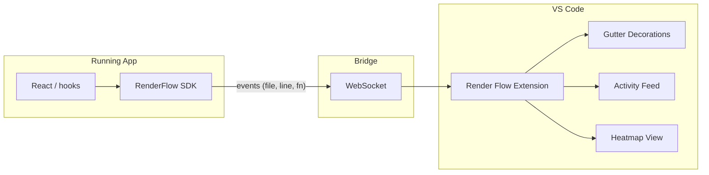

# Render Flow VS Code Plugin – Implementation Plan

## Summary of README Vision

From [README.md](README.md), **Render Flow** is a VS Code plugin that provides **real-time visual telemetry**: as you use your app, the corresponding code in VS Code is highlighted so you can trace which functions drove the latest render. It targets:

- **Live mapping:** Lines light up or show indicators as the app runs.
- **Instrumentation:** Manual (comments/gutter markers) and automatic (framework hooks, e.g. React `useState` / `setState`).
- **Visual feedback:** Gutter icons, Activity Feed sidebar, and heatmaps for "hot" paths.
- **Bridge options:** Debugger protocol, SDK (npm + WebSocket), or console-log parsing.

This plan assumes a **React-first PoC** using the **SDK + WebSocket** bridge, then expands to more frameworks and features.

---

## Architecture

- **Extension (VS Code):** Listens on a WebSocket (or configurable port). Receives events `{ file, line, functionName?, timestamp }`, updates decorations (gutter "flash"), appends to activity feed, and aggregates for heatmap.
- **SDK (in-app):** Small npm package. Patches or wraps React (and later Vue/Angular) to capture "this render was caused by X at file:line" and sends compact messages to the extension over WebSocket.
- **Protocol:** JSON over WebSocket; extension can run a small WS server and SDK connects to it (or connect to a dev-server proxy). Port and filtering (e.g. by project path) configurable in VS Code.

---

## Recommended Repo Layout

- **Monorepo** (single repo) to keep extension and SDK in sync:
  - **Root:** VS Code extension (source in `src/`, e.g. `extension.ts`, WebSocket server, decoration + sidebar logic).
  - **packages/renderflow-sdk/** (or `sdk/`): npm package for the app (React instrumentation, WebSocket client).
- **doc/** folder for design and specs (see below).

---

## Phase 1: Foundation and PoC

1. **Scaffold VS Code extension**
  - Use `yo code` (generator-code) or hand-craft: `package.json` (with `main`, `activationEvents`, `contributes`), `tsconfig.json`, `src/extension.ts`.
  - Activation: e.g. on workspace open or on command "Render Flow: Start".
  - Contributes: one command to start/stop listening, optional "Activity Feed" view container + tree view.
2. **WebSocket server inside extension**
  - Listen on a configurable port (e.g. `8765`). Accept connections from the SDK.
  - Parse JSON messages: at minimum `{ filePath, line, column?, functionName?, kind? }` (path can be absolute or relative to workspace).
  - Resolve `filePath` to a workspace file and track last N events for the activity feed.
3. **Gutter decorations**
  - Use `vscode.window.createTextEditorDecorationType()` and `editor.setDecorations()` to show a "flash" or dot next to the active line(s). Option: short-lived highlight (e.g. 1–2 s) to avoid strobe effect.
  - Map `filePath` + `line` to `vscode.Uri` and `Range`; support multi-workspace if needed.
4. **Activity Feed (sidebar)**
  - Tree or list view showing the sequence of "render triggers" (file:line + function name). Data source: in-memory list of last N events from WebSocket. Optional: click to open file at line.
5. **React SDK (PoC)**
  - New package in `packages/renderflow-sdk`: `connect(port?)`, `sendEvent({ filePath, line, functionName })`.
  - React: use a small runtime hook or wrapper that captures "current component" and stack (e.g. via `Error.stack` or a babel/transform that injects location). For PoC, even manual `sendEvent` from a few components is enough to validate the pipeline.
  - Build and publish (or link) so a sample React app can `import { connect, sendEvent } from 'renderflow-sdk'` and see VS Code gutter + feed update.
6. **Docs in `doc/`**
  - **doc/ARCHITECTURE.md:** High-level architecture (extension + SDK + WebSocket), data flow, and where noise control / filtering will plug in later.
  - **doc/PROTOCOL.md:** WebSocket message format (event schema, optional ping/pong, reconnect), and how the extension discovers port/host (e.g. env or config).
  - **doc/DEVELOPMENT.md:** How to run and debug the extension (F5), how to run the SDK in a sample app, and how to add new event types.

---

## Phase 2: Noise Control and UX

- **Filtering:** Configurable by glob (e.g. only `src/**`), by "min interval" between flashes for the same line, or by function name pattern. Store in workspace or user settings.
- **Throttling / batching:** Batch rapid events and show a single "burst" indicator to avoid strobe effect.
- **Activity feed:** Limit list size, optional clear button, and "pause" to freeze feed while inspecting.

---

## Phase 3: Heatmaps and Framework Expansion

- **Heatmap:** Aggregate events per file/line over a session; show in a simple view (e.g. sidebar or editor overlay) as "hot" lines. Persist optionally (e.g. in workspace state).
- **Vue / Angular:** Implement similar instrumentation in the SDK and reuse same protocol and extension UI.
- **Manual instrumentation:** Document a convention (e.g. `// renderflow:watch` or a function `renderflow.mark('label')`) and have SDK send events for those; extension can show them in the same feed and gutter.

---

## Implementation Notes

- **Latency:** Keep WebSocket messages small; extension should update decorations in a debounced or throttled way to keep UI responsive.
- **Framework drift:** Keep the protocol generic (file, line, functionName, framework?) so the extension stays framework-agnostic; only the SDK is React/Vue/Angular-specific.
- **Security:** WebSocket server should bind to localhost only; document that this is for local development only.

---

## Documents to Add Under `doc/`

| Document            | Purpose                                                                                       |
| ------------------- | --------------------------------------------------------------------------------------------- |
| **ARCHITECTURE.md** | System overview, extension vs SDK, WebSocket role, data flow, future filtering/heatmap hooks. |
| **PROTOCOL.md**     | WebSocket URL, message schema (event payload), reconnection, and port/config.                 |
| **DEVELOPMENT.md**  | Build, run, debug extension; run sample app with SDK; add new events or views.                |

Optional later: **CONTRIBUTING.md** (code style, how to add a new framework in the SDK).

---

## Suggested First Steps (When Implementing)

1. Scaffold the VS Code extension and add a minimal WebSocket server in `extension.ts`.
2. Implement gutter decoration + in-memory activity list from mock events (no SDK yet).
3. Add `packages/renderflow-sdk` with `connect()` and `sendEvent()` and a minimal React PoC (e.g. one button that sends a fixed file:line).
4. Wire real React instrumentation (e.g. one hook that reports current component location).
5. Write `doc/ARCHITECTURE.md`, `doc/PROTOCOL.md`, and `doc/DEVELOPMENT.md` so the design is fixed and repeatable for Phase 2/3.

This keeps the first milestone small (one bridge, one framework, gutter + feed) and sets a clear path for noise control, heatmaps, and multi-framework support.
